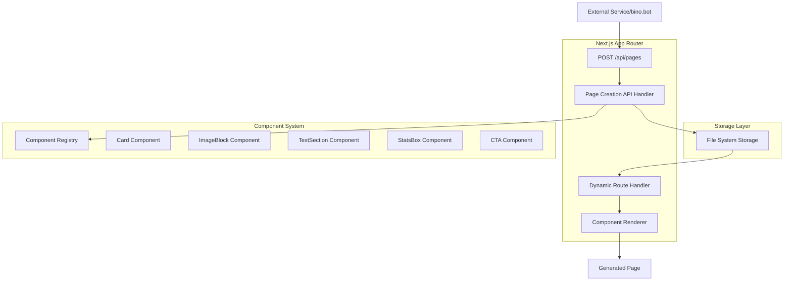

# Design Document

## Overview

The dynamic page generator will extend the existing Next.js 15 application with App Router to support runtime page creation through a REST API. The system will use a file-based storage approach to persist page configurations and leverage Next.js dynamic routing to serve generated pages. The architecture will be built around reusable React components that can be composed through API calls.

## Architecture

### High-Level Architecture



### File Structure

```
app/
├── api/
│   └── pages/
│       └── route.js              # POST endpoint for page creation
├── [slug]/
│   └── page.js                   # Dynamic route for generated pages
├── components/
│   ├── Card.js                   # Reusable Card component
│   ├── ImageBlock.js             # Image display component
│   ├── TextSection.js            # Text content component
│   ├── StatsBox.js               # Statistics display component
│   ├── CTA.js                    # Call-to-action component
│   └── ComponentRenderer.js      # Component orchestration
├── lib/
│   ├── pageStorage.js            # File system operations
│   └── componentRegistry.js      # Component mapping
└── data/
    └── pages/                    # JSON files for page configurations
        ├── demo-page-1.json
        └── demo-page-2.json
```

## Components and Interfaces

### API Endpoint Interface

**POST /api/pages**

Request Body:
```json
{
  "slug": "string",           // URL slug for the page
  "title": "string",          // Page title for metadata
  "description": "string",    // Page description for metadata
  "components": [
    {
      "type": "Card|ImageBlock|TextSection|StatsBox|CTA",
      "props": {
        // Component-specific properties
      }
    }
  ]
}
```

Response:
```json
{
  "success": true,
  "url": "/{slug}",
  "message": "Page created successfully"
}
```

### Component Specifications

#### 1. Card Component
```javascript
// Props interface
{
  title: string,
  content: string,
  variant: "default" | "outlined" | "elevated"
}
```

#### 2. ImageBlock Component
```javascript
// Props interface
{
  src: string,           // Image URL
  alt: string,           // Alt text
  width: number,         // Image width
  height: number,        // Image height
  caption?: string       // Optional caption
}
```

#### 3. TextSection Component
```javascript
// Props interface
{
  heading?: string,      // Optional section heading
  content: string,       // Main text content
  alignment: "left" | "center" | "right"
}
```

#### 4. StatsBox Component
```javascript
// Props interface
{
  stats: [
    {
      label: string,
      value: string | number,
      icon?: string      // Optional icon name
    }
  ]
}
```

#### 5. CTA Component
```javascript
// Props interface
{
  text: string,          // Button text
  href: string,          // Link destination
  variant: "primary" | "secondary" | "outline",
  size: "small" | "medium" | "large"
}
```

### Component Registry

The component registry will map component type strings to React components:

```javascript
const COMPONENT_REGISTRY = {
  'Card': Card,
  'ImageBlock': ImageBlock,
  'TextSection': TextSection,
  'StatsBox': StatsBox,
  'CTA': CTA
};
```

## Data Models

### Page Configuration Model

```javascript
{
  slug: string,           // Unique identifier and URL path
  title: string,          // Page title for <head>
  description: string,    // Meta description
  createdAt: string,      // ISO timestamp
  components: [
    {
      id: string,         // Unique component instance ID
      type: string,       // Component type from registry
      props: object       // Component-specific properties
    }
  ]
}
```

### Storage Strategy

- **File-based storage**: JSON files in `app/data/pages/` directory
- **Naming convention**: `{slug}.json`
- **Atomic writes**: Use temporary files and rename for consistency
- **Validation**: Schema validation before storage

## Error Handling

### API Error Responses

```javascript
// Validation errors
{
  success: false,
  error: "VALIDATION_ERROR",
  message: "Invalid component type: InvalidComponent",
  details: { /* validation details */ }
}

// Duplicate slug
{
  success: false,
  error: "SLUG_EXISTS",
  message: "Page with slug 'example' already exists"
}

// Storage errors
{
  success: false,
  error: "STORAGE_ERROR",
  message: "Failed to save page configuration"
}
```

### Page Rendering Error Handling

- **Missing page**: Return Next.js 404 page
- **Invalid component**: Skip invalid components, log warnings
- **Missing props**: Use component defaults where possible
- **Storage read errors**: Return 500 error with generic message

### Error Boundaries

Implement React Error Boundaries around:
- Individual component rendering
- Complete page rendering
- API request processing

## Testing Strategy

### Unit Tests

1. **Component Tests**
   - Test each of the 5 components with various prop combinations
   - Test component rendering with missing/invalid props
   - Test component styling and accessibility

2. **API Handler Tests**
   - Test valid page creation requests
   - Test validation error scenarios
   - Test duplicate slug handling
   - Test storage failure scenarios

3. **Utility Function Tests**
   - Test page storage operations
   - Test component registry lookups
   - Test JSON schema validation

### Integration Tests

1. **End-to-End Page Creation**
   - Create page via API
   - Verify page is immediately accessible
   - Verify correct component rendering

2. **Dynamic Route Tests**
   - Test page loading with various component combinations
   - Test 404 handling for non-existent pages
   - Test page metadata rendering

### Demo Page Creation

Create two demo pages during development:

1. **Marketing Landing Page** (`/demo-landing`)
   - ImageBlock with hero image
   - TextSection with product description
   - StatsBox with key metrics
   - CTA for sign-up

2. **Product Showcase** (`/demo-product`)
   - Card with product features
   - ImageBlock with product screenshots
   - TextSection with detailed description
   - CTA for purchase

### Performance Considerations

- **Static Generation**: Consider ISR (Incremental Static Regeneration) for frequently accessed pages
- **Image Optimization**: Use Next.js Image component for ImageBlock
- **Component Lazy Loading**: Implement dynamic imports for components if needed
- **Caching**: Add appropriate cache headers for generated pages

### Security Considerations

- **Input Validation**: Strict validation of all API inputs
- **XSS Prevention**: Sanitize all user-provided content
- **Rate Limiting**: Implement rate limiting on the API endpoint
- **File System Security**: Restrict file operations to designated directories
- **CORS Configuration**: Configure appropriate CORS headers for API access